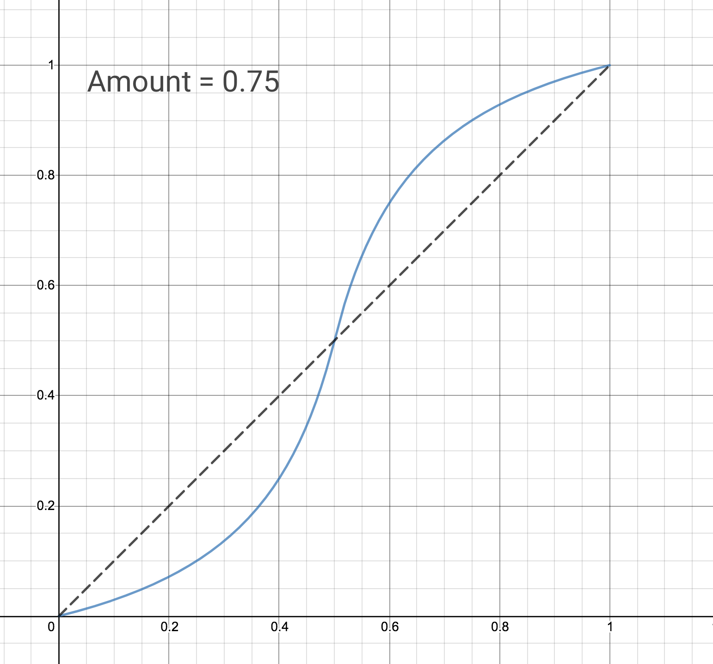

# `tapers`

[](https://www.npmjs.com/package/tapers)
[](https://github.com/47ng/tapers/blob/master/LICENSE)
[](https://travis-ci.com/47ng/tapers)
[](https://dependabot.com)
[](https://isitmaintained.com/project/47ng/tapers)
[](https://isitmaintained.com/project/47ng/tapers)

Map values between [0;1] to [X,Y] with various curves.

Check out the [Demo website](https://tapers.47ng.com).

## Featured Tapers

- [Linear](#linear-taper)
- [Piecewise Linear](#piecewise-linear-taper)
- [S-Curve](#s-curve-taper)

## Installation

```shell
$ yarn add tapers
# or
$ npm i tapers
```

## Documentation

### Linear Taper

Implements an affine function `a * x + b`.

```ts
import { LinearTaper } from 'tapers'

const taper = new LinearTaper(3, 5)
taper.map(0) // => 3
taper.map(0.5) // => 4
taper.map(1) // => 5
```

### Piecewise Linear Taper

Given an array of Y values, interpolate linearily between those points.

```ts
import { PiecewiseLinearTaper } from 'tapers'

const taper = new PiecewiseLinearTaper([3, 5, 2, 12])
taper.map(0) // => 3
taper.map(0.5) // => 3.5
taper.map(1) // => 12
```

### S-Curve Taper

A [0;1] to [0;1] mapping curve with 3 inflexion points (y === x): 0, 1
and 0.5, with a configurable S-shape bend.

```ts
import { SCurveTaper } from 'tapers'

const taper = new SCurveTaper(0.75)
taper.map(0) // => 0
taper.map(0.25) // => 0.1
taper.map(0.5) // => 0.5
taper.map(0.75) // => 0. 9
taper.map(1) // => 1
```

See this taper in action on [Desmos](https://www.desmos.com/calculator/0jnlso1nwz) :

[](https://www.desmos.com/calculator/0jnlso1nwz)

## License

[MIT](https://github.com/47ng/tapers/blob/master/LICENSE) - Made with ❤️ by [François Best](https://francoisbest.com) - [Donations welcome](https://paypal.me/francoisbest?locale.x=fr_FR) 🙏
